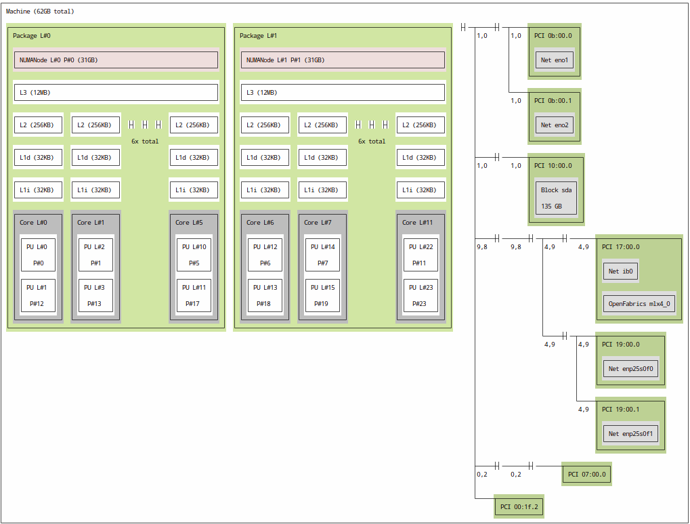

### Group 3: Göthert Philipp Robert, Schmid Leopold Julius, Seling Tobias	

# Assignment 2

## Exercise 1

- Number of CPUs per Node: 2, 6 cores per CPU, 32 GB of RAM
- L3 Cache: 12 MB, L2 Cache: 256 KB, L1d (data cache): 32 KB, L1i (instruction cache): 32 KB
- NUMANodes shows us the memory architecture
- connected network cards, 135 GB hard disk
- 12 threads at max, since I can not see the number of nodes of the HPC, Specifications: 162 compute nodes with 12 cores each, so at max: 1944

## Exercise 2

- Speedup definition: the ratio of the compute time for the sequential algorithm to the time for the parallel algorithm
- Amdahl's law describes that the maximum potential improvement in speed of a program is limited by the most significant bottleneck. This is important since it helps us to determine the maximum potential for improving system performance in a simple and efficient way. This is crucial for decision making, especially when it comes to decisions like wether it is worth to develop a parallel implementation or not.

#### Speedup computation

Amdahl's law:

$$ S = {1 \over {(1 - f) + {f \over N}}} $$

where
- `f` is the fraction of the algorithm that can be parallelized
- `N` is the number of cores

Compute the theoretical speedup of a program that spends 10% of its time in unparallelizable, sequential regions for 6 cores and for a hypothetically unlimited number of cores.

$$ S = {1 \over {(1 - 0.90) + {0.90 \over 6}}} $$

$$ S = 4 $$

Speedup with a $\infty$ amount of cores:

$$ S\lim_{N \to \infty } = {1 \over {(1 - 0.90) + {0.90 \over N}}} $$

$$ S = 10 $$

Compute the theoretical speedup of a program that spends 20% of its time in unparallelizable, sequential regions for 6 cores and for a hypothetically unlimited number of cores.

$$ S = {1 \over {(1 - 0.80) + {0.80 \over 6}}} $$
$$ S = 2.999 $$

Speedup with a $\infty$ amount of cores:

$$ S\lim_{N \to \infty } = {1 \over {(1 - 0.80) + {0.80 \over N}}} $$
$$ S = 5 $$ 

Given an algorithm of time complexity O(n^3). How large (in %) can the unparallelizable, sequential region be at most, such that a speedup of 10 can be achieved using 64 cores?

$$ 10 = 1 \over {(1 - f) + {f \over 64}} $$
$$ {-315f \over 32} = -9 * 32 $$
$$ f \approx 0.914 $$