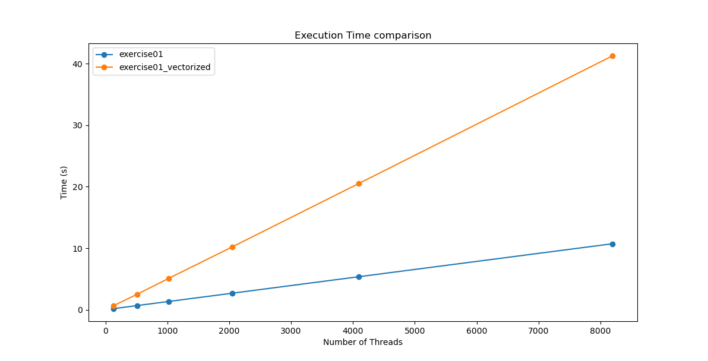
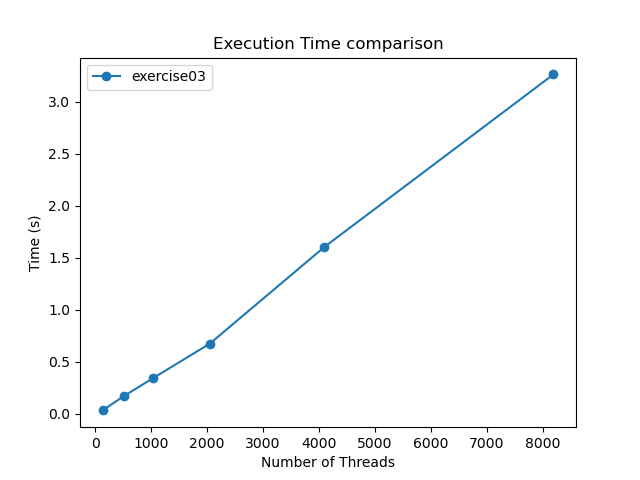

#### Team Philipp Göthert, Leopold Schmid


# Assignment 9

The goal of this assignment is to study several means of vectorizing a simple program.

## Exercise 1 (1 Point)

### Description

In this exercise, we will employ auto-vectorization of the compiler to increase the performance of a small program that computes a multiply-add operation on three vectors.

### Tasks

- Write a sequential program that computes `a[i] += b[i] * c[i]` for three `float` vectors `a`, `b`, and `c`. Enclose this computation in a loop such that it is repeated `1e6` times. I.e. your code should look like this:

```
for(int run = 0; run < repetitions; ++run) {
    for(int i = 0; i < size; ++i) {
        a[i] += b[i] * c[i];
    }
}
```

- Initialize the vectors with constant values and add some output that allows you to verify correct computation of the program for subsequent optimization steps (try to avoid overflows). Compile this program on LCC3 with `gcc 12.2.0` using `-O1` and measure the execution time **of the computation only** for several problem sizes (=vector lengths). This sequential program is our baseline reference.
- Try to use auto-vectorization in the compiler to vectorize the computation. Investigate which flag(s) to use for that, and try to limit your compiler change to only enable vectorization but not any other optimizations. Measure the execution time for the same problem sizes as before and compute the respective speedups. What can you observe in terms of performance? Is the result still correct? Does varying the problem size affect the performance gain or loss?

  > The OpenMP-vectorized code and the compiler-optimized code perform similarly, both significantly faster than the sequential version. The output is still correct.
  The OpenMP vectorization aligns well with the compiler's auto-vectorization capabilities, providing similar performance benefits. So manual vectorization using OpenMP can be as effective as relying on the compiler's optimizations when properly utilized. The performance gain is linear in both cases. So increasing the problem size leads to wider gap between the execution times.

- Use `perf` to further investigate the origin of any performance difference you might observe. `perf stat -e rYYXX` (mind the order of X and Y!) allows you to measure custom events supported by the CPU, where - on Intel systems - XX is the so-called _event code_ and YY is the so-called _unit mask_ (also called _umask_). A few event codes and unit masks for measuring vectorized instructions are given below. Check which ones are suitable for your investigation:

  | Name                                 | Event Code | Unit Mask | Result (512) |    Description    |
  |--------------------------------------|:----------:|:---------:|:------------:|:------------------|
  | FP_COMP_OPS_EXE.X87                  |     10     |    01     |     1.110    | Counts floating-point operations executed by the x87 FPU (Floating Point Unit). The x87 is the older floating-point unit used in Intel processors prior to the introduction of SSE. |
  | FP_COMP_OPS_EXE.MMX                  |     10     |    02     |       0      | Counts the number of MMX (MultiMedia eXtensions) operations executed. MMX is an older SIMD instruction set designed for multimedia tasks. |
  | FP_COMP_OPS_EXE.SSE_FP               |     10     |    04     |       9      | Counts the number of SSE (Streaming SIMD Extensions) floating-point operations executed. SSE is a SIMD instruction set used for processing multiple data points in parallel, specifically for floating-point arithmetic. |
  | FP_COMP_OPS_EXE.SSE2_INTEGER         |     10     |    08     |  8.620.839   | Counts the number of integer operations executed using the SSE2 instruction set. SSE2 extends the original SSE instruction set to support double-precision (64-bit) floating-point arithmetic and integer operations. |
  | FP_COMP_OPS_EXE.SSE_FP_PACKED        |     10     |    10     |       0      | Counts the number of packed single-precision floating-point operations executed using SSE. "Packed" means that multiple data elements are processed simultaneously within a single SIMD register. |
  | FP_COMP_OPS_EXE.SSE_FP_SCALAR        |     10     |    20     |      10      | Counts the number of scalar single-precision floating-point operations executed using SSE. "Scalar" operations process one data element at a time, as opposed to packed operations which handle multiple elements. |
  | FP_COMP_OPS_EXE.SSE_SINGLE_PRECISION |     10     |    40     |       0      | Counts the number of single-precision (32-bit) floating-point operations executed using SSE. |
  | FP_COMP_OPS_EXE.SSE_DOUBLE_PRECISION |     10     |    80     |       10     | Counts the number of double-precision (64-bit) floating-point operations executed using SSE. |

  <sub>In case you are interested: For further events relevant to the CPU type on LCC3 and short event descriptions, see [Intel's perfmon web interface](https://perfmon-events.intel.com/) (pay attention to choosing a suitable micro-architecture) or alternatively [Intel® 64 and IA-32 Architectures Software Developer’s Manual Volume 3B: System Programming Guide, Part 2](https://www.intel.com/content/www/us/en/architecture-and-technology/64-ia-32-architectures-software-developer-vol-3b-part-2-manual.html). It lists all events that can be counted with `perf` on our hardware.</sub>

- Enter the wall clock time of the sequential program and the auto-vectorized version with size 2048 and 1e6 repetitions to the spreadsheet linked on Discord.



(X-axis shows the problem size of the matrixes. The amount of repititions is set to a static number: 1e6)

## Exercise 2 (1 Point)

### Description

Instead of relying on the compiler to vectorize the code for us, we will do so manually in this exercise, using OpenMP.

### Tasks

- Vectorize your sequential program using OpenMP. Do not use any OpenMP thread-based parallelism.
- Compile your OpenMP-vectorized code with `-O1` but without any compiler flags for auto-vectorization and compare its performance for the problem size 2048 to both the sequential version and the compiler-vectorized version. What can you observe? Is the result still correct?
- Verify any findings using `perf` as described in Exercise 1.
- Repeat the sequential and OpenMP executions when changing the data type from `float` to `double`. What can you observe?
  > Sequential Execution (not vectorized): The times for sequential execution are similar for both data types, indicating the base computational complexity is comparable regardless of the data type. OpenMP Execution: The OpenMP-accelerated execution for doubles is slower (1.566916 seconds) compared to floats (0.511293 seconds). This is expected due to the larger size and higher precision of double-precision floating-point numbers, which require more processing power and memory bandwidth.

- How does the solution for this Exercise compare to Exercise 1? Are there any advantages or disadvantages?

  > No real differences. One advantage of openmp could be, that you have control over what´s getting vectorized.

- Enter the wall clock time of the OpenMP-vectorized version with size 2048, 1e6 repetitions and data type `float` to the spreadsheet linked on Discord.

## Exercise 3 (1 Point)

### Description

Instead of relying on OpenMP for vectorization, we will do so using compiler-specific intrinsics in this exercise.

### Tasks

- Vectorize your code for `float` types using the gcc-specific intrinsic functions `_mm_load_ps`, `_mm_add_ps`, `_mm_mul_ps`, and `_mm_store_ps`. Do not forget to include the respective header `xmmintrin.h`.
- Compile your manually vectorized code with `-O1` but without any compiler flags for auto-vectorization and compare its performance for your set of problem sizes to your previous code versions. What can you observe? Is the result still correct?

  > Difficult to compare output, since the results differ (as expected) due to the float operations. 

- Verify any findings using `perf` as described in Exercise 1.
- How does the solution for this Exercise compare to Exercise 2 and Exercise 1? Are there any advantages or disadvantages?

  > Much faster than using the auto vectorization of the compiler. 
- Enter the wall clock time of the compiler-specific intrinsics version with size 2048 and 1e6 repetitions to the spreadsheet linked on Discord.

| Name                                 | Event Code | Unit Mask | Result (512) |
  |--------------------------------------|:----------:|:---------:|:------------:|
  | FP_COMP_OPS_EXE.X87                  |     10     |    01     |     2.113    |
  | FP_COMP_OPS_EXE.MMX                  |     10     |    02     |       0      |
  | FP_COMP_OPS_EXE.SSE_FP               |     10     |    04     |  256.022.752 |
  | FP_COMP_OPS_EXE.SSE2_INTEGER         |     10     |    08     |    11.578    |
  | FP_COMP_OPS_EXE.SSE_FP_PACKED        |     10     |    10     |  256.019.921 |
  | FP_COMP_OPS_EXE.SSE_FP_SCALAR        |     10     |    20     |     2.571    |
  | FP_COMP_OPS_EXE.SSE_SINGLE_PRECISION |     10     |    40     |  256.036.138 |
  | FP_COMP_OPS_EXE.SSE_DOUBLE_PRECISION |     10     |    80     |     2.057    |

  

  (X-axis shows the problem size of the matrixes. The amount of repititions is set to a static number: 1e6)

## General Notes

All the material required by the tasks above (e.g., code, figures, text, etc...) must be part of the solution that is handed in. Your experiments should be reproducible and comparable to your measurements using the solution materials that you hand in.

**Every** member of your group must be able to explain the given problem, your solution, and possible findings. You may also need to answer detailed questions about any of these aspects.
